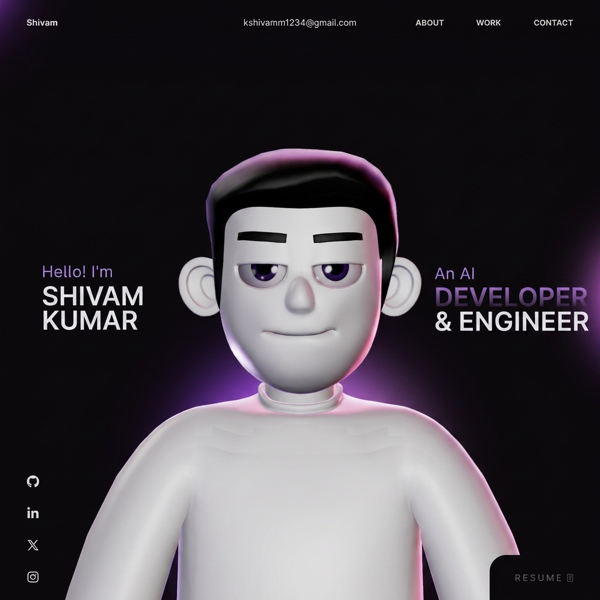

# Shivam Kumar | Personal Portfolio Website 🚀

This repository contains the open-source version of my personal portfolio website.
A high-performance creative developer portfolio built with React, TypeScript, GSAP, and Three.js.

Feel free to explore the code and use it for learning and inspiration.

---

## 📸 Portfolio Preview



---

## ⚙️ Tech Stack

- **Framework:** React (Vite)
- **Language:** TypeScript
- **3D Graphics:** Three.js / React Three Fiber / React Three Drei
- **3D Physics:** @react-three/rapier (for physics-based interactive tech stack bubbles)
- **Animations:** GSAP & ScrollSmoother
- **Styling:** Custom Vanilla CSS

---

## 🛠️ Getting Started

To run the project locally, follow these steps:

1. **Clone the repository:**
   ```bash
   git clone https://github.com/Shivam8292/My_Portfolio.git
   cd My_Portfolio
   ```

2. **Install dependencies:**
   ```bash
   npm install
   ```

3. **Run the development server:**
   ```bash
   npm run dev
   ```

4. **Build for production:**
   ```bash
   npm run build
   ```

---

## ⚠️ Usage & Attribution Notice

This project is shared for educational and reference purposes. 

If you use parts of the code or are inspired by this design, please ensure you give proper credit to:
- **Shivam Kumar** (This repository)
- **Moncy Yohannan** (Original layout/visual inspiration: [moncy.dev](https://www.moncy.dev))

Please do **NOT**:
- Copy or clone the entire design/experience and deploy it as your own.
- Use it for commercial/client work without permission.

---

## 🎨 Assets & 3D Avatar

- Some 3D assets and model files included in this project are for educational reference.
- The interactive avatar and specific 3D assets are proprietary and protected under the license.

---

## 📄 License

This project is licensed under the Personal Portfolio License (PPL) v1.0. See the `LICENSE` file for details.
