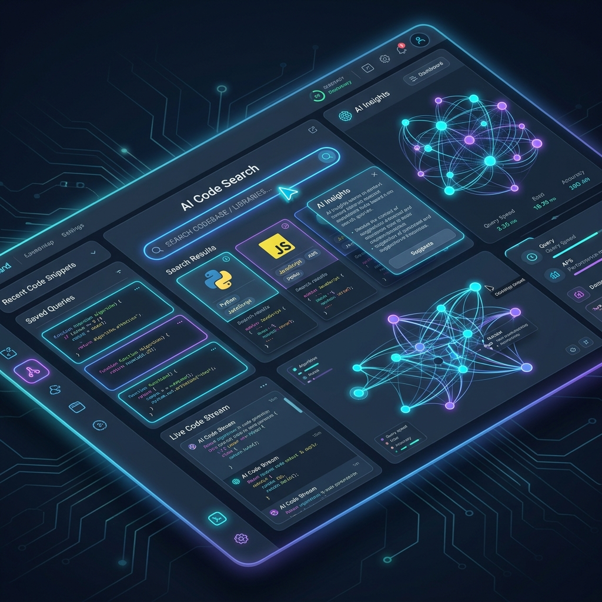
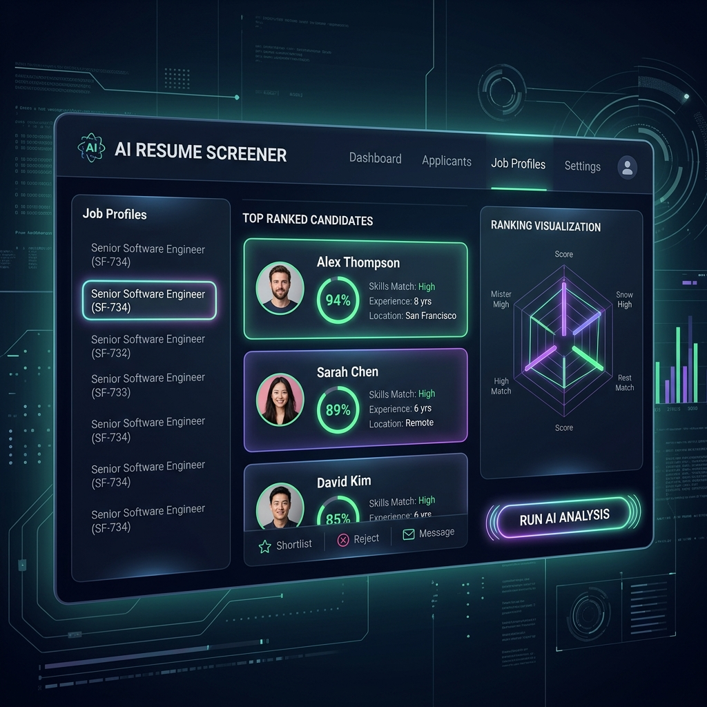
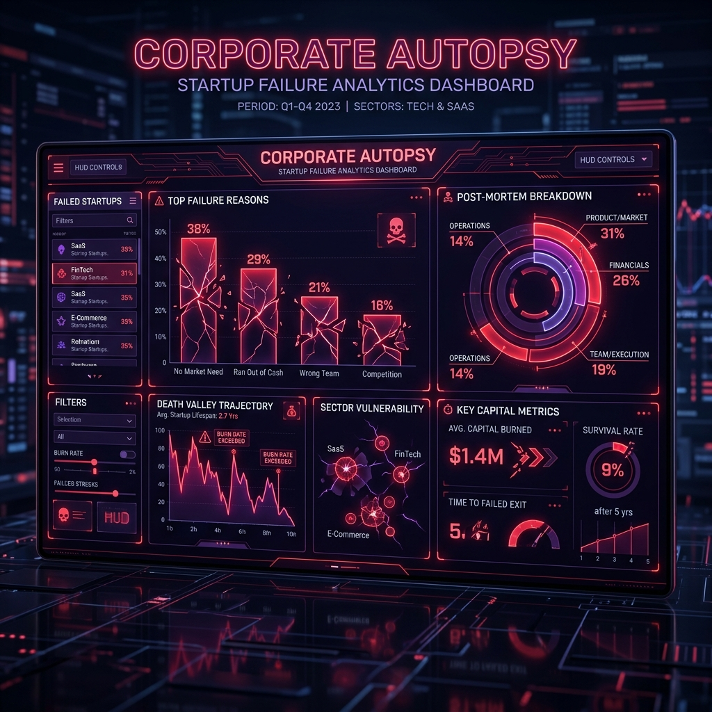
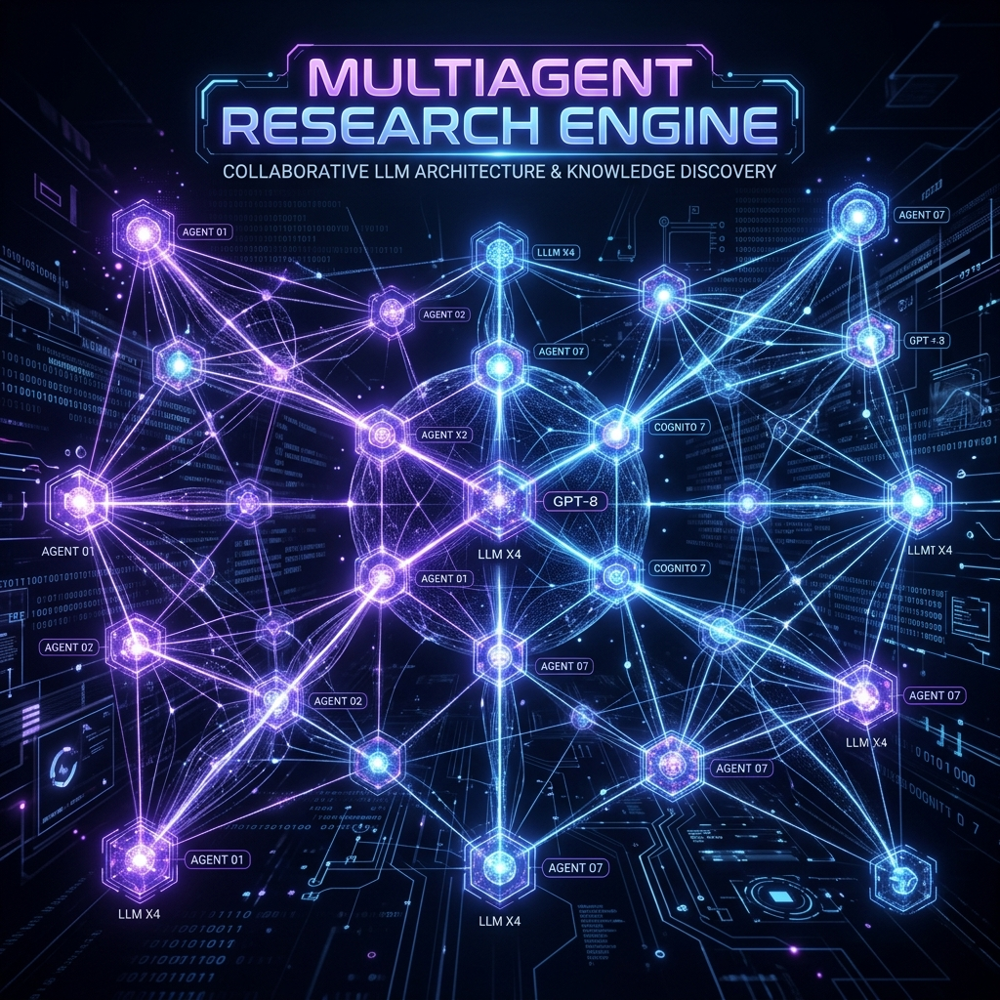
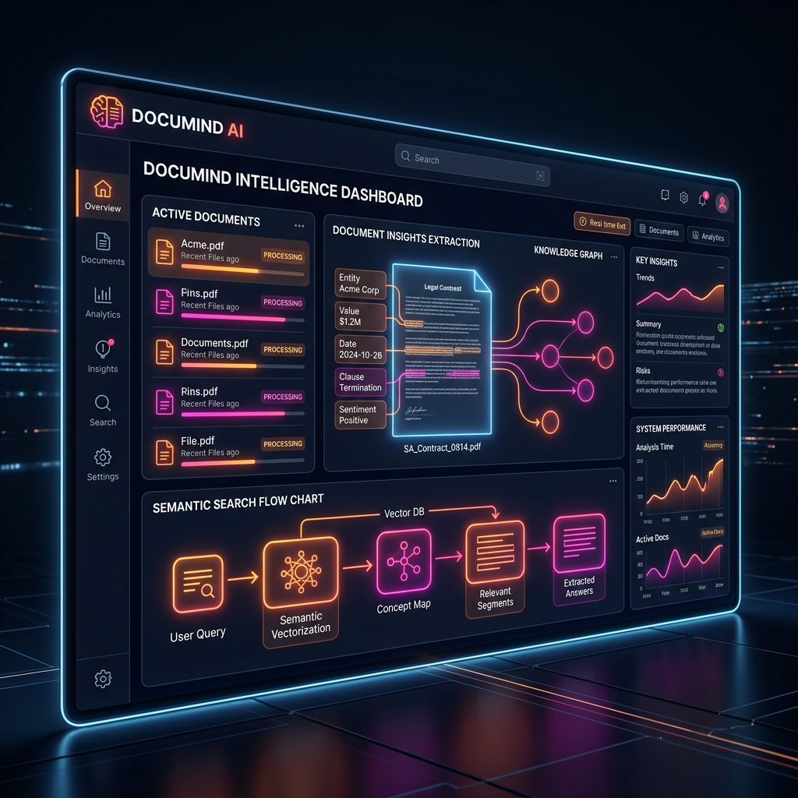

# Shivam Kumar | AI Developer & Full-Stack Engineer 🚀

Welcome to my personal portfolio repository! This is a modern, high-performance developer portfolio built using **React**, **TypeScript**, **Three.js (React Three Fiber)**, **GSAP**, and **Rapier Physics**. It showcase interactive 3D experiences, animated transitions, and selected production-ready AI and software engineering projects.

---

## 🔗 Live Links & Contact
- **LinkedIn:** [Shivam Kumar](https://linkedin.com/in/shivam-kumar-ai)
- **GitHub:** [@Shivam8292](https://github.com/Shivam8292)
- **Email:** [kshivamm1234@gmail.com](mailto:kshivamm1234@gmail.com)

---

## 🌟 Key Features

- **Interactive 3D Avatar:** A dynamic 3D avatar that responds to mouse movements, created using Three.js/React Three Fiber.
- **3D Physics Tech Stack:** A container of interactive, colliding physics spheres representing skills, layered over a clean background list for maximum readability.
- **Custom Projects Cards:** Stacking card components built with smooth scroll interactions driven by GSAP ScrollTrigger and ScrollSmoother.
- **Direct Mail Contact:** Direct interaction capability to send queries straight to my email.

---

## 🛠️ Tech Stack

**Frontend & Creative Tech:**
- React (Vite)
- TypeScript
- Three.js / React Three Fiber / React Three Drei
- @react-three/rapier (3D Physics)
- GSAP & ScrollSmoother (Animations)
- Custom CSS (Responsive layout & neon glow theme)

**Backend & AI Engine (Used in projects):**
- Python & FastAPI
- LangChain & Multi-agent frameworks
- Google Gemini 2.0/2.5 & Llama 3.3 (via Groq)
- ChromaDB & Vector Embeddings

---

## 📂 Selected Works

Here are the projects featured in this portfolio, showing systems built and technical problems solved:

### 1. Reposage
*AI-powered code search engine indexing GitHub repos for natural language queries — powered by AST-based function-level chunking.*
- **Tech Stack:** Python, FastAPI, React, LangChain
- **Key Concepts:** `// AST_CHUNKING`, `// SEMANTIC_SEARCH`, `// RAG_PIPELINE`
- **Repository:** [GitHub Link](https://github.com/Shivam8292/Reposage)



---

### 2. AI Resume Screener (SleekScan)
*Semantic RAG-based resume ranking system using FastAPI, Llama 3.3 (Groq), and HuggingFace embeddings for high-precision candidate-JD matching.*
- **Tech Stack:** FastAPI, Llama 3.3, HuggingFace
- **Key Concepts:** `// ASYNC_PIPELINE`, `// LLAMA_3.3`, `// EXPLAINABLE_SCORING`
- **Repository:** [GitHub Link](https://github.com/Shivam8292/SleekScan)



---

### 3. Corporate Autopsy Machine
*A RAG-based platform using Gemini 2.0 to automate forensic startup failure analysis and reporting. Vectorized 400+ startup failures.*
- **Tech Stack:** Gemini 2.0, ChromaDB, React
- **Key Concepts:** `// DEATH_SCORE_GEN`, `// CHROMA_DB`, `// RISK_ANALYSIS`
- **Repository:** [GitHub Link](https://github.com/Shivam8292/Corporate-Autopsy-Machine)



---

### 4. Multiagent Research Engine
*Multi-agent deep research system powered by Gemini 2.5 Flash and Tavily Search API, orchestrating 5 specialized agents to collaborate and generate reports.*
- **Tech Stack:** FastAPI, React, Gemini 2.5, Tavily
- **Key Concepts:** `// MULTI_AGENT_FLOW`, `// GEMINI_2.5_FLASH`, `// DEEP_RESEARCH`
- **Repository:** [GitHub Link](https://github.com/Shivam8292/multiagent-research-engine)



---

### 5. Documind
*A seamless intelligent document analysis platform for querying complex PDF datasets with high accuracy using semantic embeddings.*
- **Tech Stack:** AI, RAG, Embeddings
- **Key Concepts:** `// PDF_ANALYSIS`, `// HIGH_ACCURACY`, `// SEMANTIC_SEARCH`
- **Repository:** [GitHub Link](https://github.com/Shivam8292/Documind)



---

## ⚙️ Running Locally

1. **Clone the repository:**
   ```bash
   git clone https://github.com/Shivam8292/Shivam_Portfolio.git
   cd Shivam_Portfolio
   ```

2. **Install dependencies:**
   ```bash
   npm install
   ```

3. **Run the development server:**
   ```bash
   npm run dev
   ```

4. **Build for production:**
   ```bash
   npm run build
   ```

---

## 🎨 Attributions & License

This project is licensed under a personal license for educational and reference purposes only. 

- **Original Design Reference & Base Visual Layout:** Inspired by and adapted from the personal website design of [Moncy Yohannan](https://github.com/moncyyohannan). Check out their creative portfolios!
- **Restrictions:** You may study the code and architecture, but cloning the complete portfolio design or using its assets commercially is prohibited.
